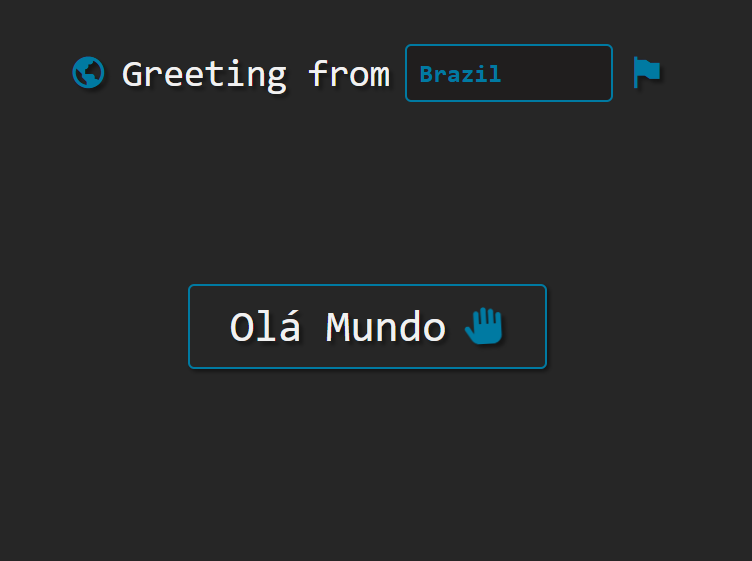

## Greetings 🌎

Projeto multilíngue de saudações usando SpringBoot e JavaScript.

A ideia é um projeto simples em que é selecionado um país dentre algumas opções. Ao selecionar, é mostrado uma mensagem "Hello World" no idioma do país selecionado.

Os países e suas respectivas saudações são armazenados em um banco de dados H2, que está sendo executado em memória, acessado pelo projeto em Spring Boot. Enquanto o processo está sendo executado, é possível acessar os dados pelo endereço _/api/greetings_. Já a parte da aplicação, basta acessar a raiz do projeto.

### Tecnologias

    
    
    
    
    
        

### Execução
O projeto foi criado com Java ([JDK-17](https://jdk.java.net/17/)) usando o [Maven](https://maven.apache.org/).

// TODO

### Referências
O ícone da página vem do [Icon-Icons](https://icon-icons.com/pt/icone/terra-planeta-globo-ambiente-mundo/191933) e a biblioteca de ícones é a [Boxicons](https://boxicons.com/).
